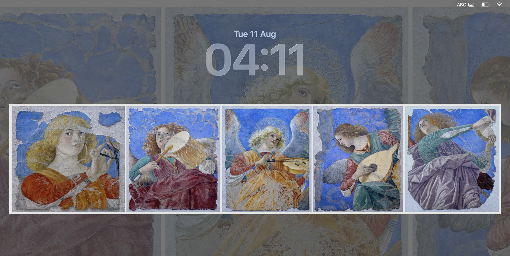

# Art — Daily Masterpieces & Wallpaper

A native menu-bar app that puts inspiring art on your desktop and lock screen.
Every day it picks the next work from a fixed, hand-curated rotation led by
Christian sacred art and the great Renaissance and Baroque masters.

## Screenshot



*The default framed treatment preserves the complete artwork while extending it naturally across the display.*

## Features

- **Art before aspect ratio** — landscape works can fill the screen; portrait,
  square and sculptural works such as Michelangelo's *Pietà* and *David* are
  preserved in full over a softened edge-to-edge background.
- **Christian sacred curation** — saints, angels, Madonna and Child, the life
  of Christ, and Vatican frescoes rank first. Architecture is limited to a few
  hand-picked works; violent and morbid themes are excluded.
- **Fixed curated library** — every artwork is selected by hand, appears only
  once in the rotation, and uses one verified Wikimedia Commons image.
- **Curated discovery** — **Add More Art** searches Wikimedia Commons only
  when requested. Accepted, deduplicated works are saved and mixed into the
  same daily rotation.
- **Set as Wallpaper** — applies the complete artwork to your desktop with a
  tasteful framed treatment by default; Fill remains available as an option.
- **Daily 9 AM Wallpaper** — installs a launchd agent that changes your
  wallpaper automatically every morning at 9:00.
- **Search** — find any work by title, artist, museum, or city.
- **Fit / Fill toggle** — switch between full-bleed fill and letterbox fit.

Images are served from **Wikimedia Commons** and cached locally, so after
the first download each work is available offline.

## Requirements

- macOS 14 or newer
- Xcode Command Line Tools (`xcode-select --install` if needed)

## Build & run

```sh
cd art-daily
./scripts/build_app.sh        # builds build/Art.app
open build/Art.app            # launch
```

To install to `/Applications`:

```sh
./scripts/install_to_applications.sh
```

## Using it

- Art lives in the **menu bar** and stays out of your Dock. Click its palette
  icon for the common actions; open **Art Library** when you want the full gallery.
- Actions are also available in the gallery top bar:
- **New Artwork** (shuffle icon, ⌘N) — advance through the catalog.
- **Set as Wallpaper** (⌥⌘W) — applies the current artwork to the desktop,
  using the selected Fit or Fill treatment.
- **Install Daily 9 AM Wallpaper** (clock icon) — registers a launchd agent
  (`com.edu.art-daily`) that applies the day's artwork at 9:00 AM. Click
  again to remove it. The app itself also refreshes at 9 AM while running.
- **Fit / Fill toggle** — switch between full-bleed fill and letterbox fit.
- macOS automatically carries the desktop image to the current user's lock screen.
  The FileVault screen shown before login is system-managed and is not modified.
- **Quit** (⌘Q).

The daily rotation resets each morning, so even after browsing ahead, the
9 AM update always shows the day's intended masterpiece.

## Headless wallpaper update

```sh
open build/Art.app --args --set-wallpaper
```

Downloads the current artwork (if needed), applies it to the desktop
  with the selected treatment, then quits. Used by the daily update agent.

## Data & sources

- **Curated catalog** — `tools/artworks.json` (43 works, Europe-focused),
  resolved to verified high-resolution Wikimedia Commons URLs by
  `tools/generate_catalog.swift` and embedded into the app as
  `Sources/Art/Support/ArtworkCatalog.swift`.
- **Per-work crops** — an optional `crop` field (fractional
  `[x, y, w, h]`, origin top-left) frames a work before display/wallpaper.
  The expanded curated rotation removes old portrait crops so the complete
  sculptures and paintings remain visible.
- **One mixed library** — the hand-curated core and accepted discoveries are
  interleaved into the same persistent daily rotation.
- **Cache & logs** — images: `~/Library/Application Support/ArtDaily/`;
  wallpaper log: `~/Library/Logs/ArtDaily/wallpaper.log`.

## Project layout

```
Sources/Art/
  App/          app entry, menu commands, --set-wallpaper handling
  Models/       Artwork model
  Services/     artwork store, image cache, launchd manager
  Views/        main view, top bar, info overlay, search, discover
  Support/      theme + generated catalog
tools/          catalog generator, icon renderer
scripts/        build & install
Resources/      Info.plist, icon
```
